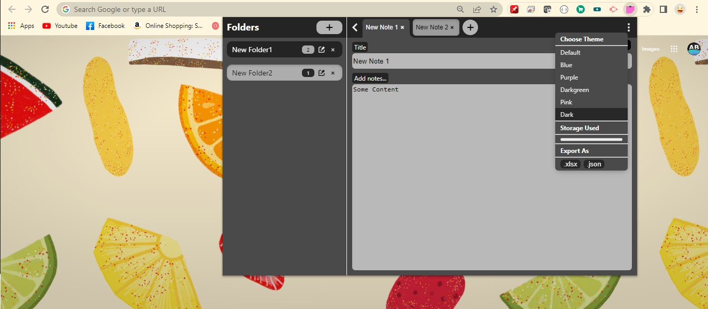

# This is a chrome extension to add notes, created using React

## Install Packages with: `npm install`

## To run the project: `npm start`

## To build: `npm run build`

#### Once the build is generated in build folder, this folder can be used to load the extension in `chrome://extensions/` with developer mode.
