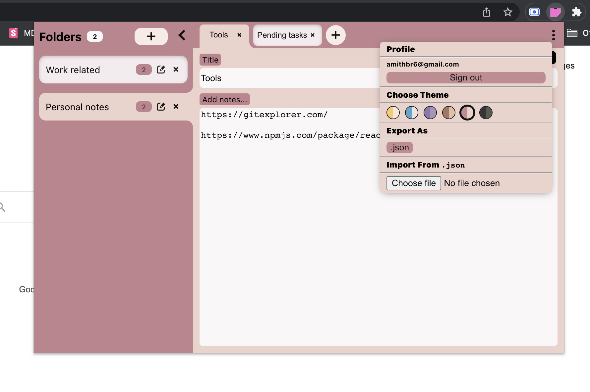

# This is a chrome extension to add notes, created using React

## Install Packages with: `npm install` on both `server` and `client` folders

## Start react app

`cd client` 
`npm start`

## Start node server

`cd server` 
`npm run start-dev-server`

## Build extension

`cd client` 
`npm run build-extension`

Once the build is generated in `client/build` folder, this folder can be used to load the extension in `chrome://extensions/` with developer mode.

## Build React app

`npm run build` 
This will generate the build in `server/build` folder.

## Environment variables

### Save below variables in `.env` file in respective folders

#### server

`TOKEN_SECRET="YOUR_JWT_TOKEN_SECRET"`
`MONGODB_URL="YOUR_MONGODB_URL"`
`DATA_ENCRYPTION_KEY="ANY_SECRET_KEY_FOR_DATA_ENCRYPTION"`
`HOST_URL="FONTEND_URL"`

`NODE_MAILER_USER="your_mail@gmail.com"`
`NODE_MAILER_PASS="MAIL_PASSWORD"`

#### client

`REACT_APP_BACKEND_URL="BACKEND_URL"`

## Random key generation

`openssl rand -hex 24`

## To run with Docker

Docker desktop should be installed before running below commands

1.`docker-componse up -d` - to start the containers in detached mode, this will start both client and the server in two different containers, once started just open `localhost:3000`

2.`docker-componse down -v` - to stop the containers and remove used volumnes
